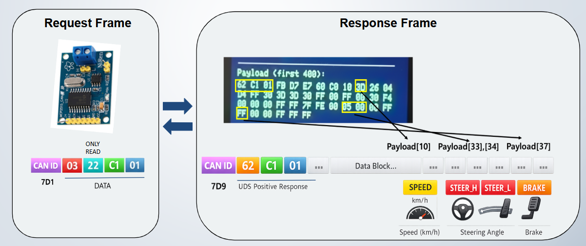
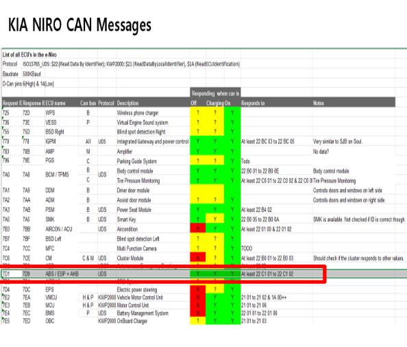
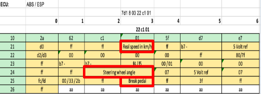
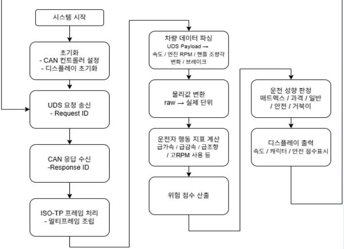
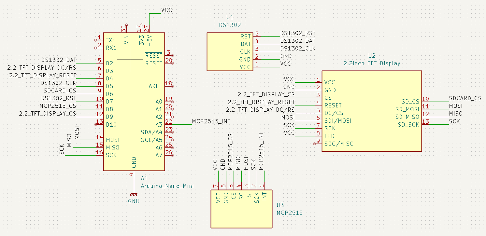

# OBD CAN 기반 운전 성향 분석 시스템

## 프로젝트 개요
차량 **OBD-II 기반 CAN 통신**으로 주행 데이터를 수집하고, 운전 행동을 분석하여 **운전 성향(캐릭터)** 및 **주행 점수**를 실시간으로 시각화하는 시스템입니다.  
속도(Speed), RPM, 조향각(Steering), 브레이크(Brake) 데이터를 활용해 운전 습관을 평가합니다.

---

## 프로젝트 목표
- 차량 OBD CAN 데이터를 **안정적으로 수집/처리**
- 위험 운전 행동과 교통 흐름 방해 행동을 분리하여 **감점 요소 설계**
- 정체 구간에서의 오판을 줄이기 위한 **보호 로직 적용**
- TFT 디스플레이를 통해 **실시간 점수/캐릭터 UI 출력**
- (추가) 세션/로그 기반으로 **주행 기록 누적 및 통계 확장 기반 마련**

---

## 시스템 구성

### 전체 구조
1. **차량 OBD-II → CAN 데이터 수신**
2. **MCP2515 CAN Controller**로 프레임 수신/송신
3. **Arduino Nano Mini**에서 UDS/ISO-TP 응답 파싱 및 점수 산출
4. **TFT LCD(ILI9341)**에 속도/조향/브레이크/RPM/점수/캐릭터 출력
5. (선택) **microSD**로 캐릭터 RAW 이미지 표시 + 주행 로그 저장
6. (선택) **DS1302 RTC**로 타임스탬프(날짜/시간) 기록

---

## CAN/UDS 통신 방식(요청-응답)

차량 ECU와는 CAN 버스를 통해 통신하며, 필요한 값은 **UDS(ReadDataByIdentifier, 0x22)** 요청으로 읽어옵니다.

- **Request (예시)**: `0x22 C1 01`  → “DID=C101 읽어줘”
- **Response (Positive)**: `0x62 C1 01 ...payload...`  
  - 응답 서비스 ID는 일반적으로 `요청ID + 0x40` 규칙 (0x22 → 0x62)

> 수신한 응답 프레임의 payload는 **바이트 오프셋/길이/부호/스케일링/엔디안** 규칙에 따라 물리값으로 변환합니다.

### -통신 흐름 그림

### -ECU / CAN ID 맵 

### -Payload 바이트 매핑 

---

## 동작 방식
- CAN 통신으로 주행 데이터를 **주기적으로 수신**합니다.
- 수신 값은 노이즈/스파이크 완화를 위해 **필터링(이동평균/저역통과 등)** 후 점수 로직에 적용됩니다.
- 감점 요인은 아래와 같이 **위험 요인 / 흐름 방해 / 정체 보호**로 구성됩니다.

---

## 감점 요인 설계

### [위험 요인 감점]
- 급가속
- 급제동
- 급조향
- 고속 + 급조향
- 고RPM 유지
- 급가속 + 급조향 동시 발생
- 위험 행동 반복(누적 패널티)

### [흐름 방해 감점]
- 저속 지속
- 평균 대비 과도한 저속
- 불필요 감속 후 회복 지연
- 저속 시간 누적 감점

### [정체 구간 보호(오판 방지)]
- 정체 판단 시 **흐름 방해 감점 적용 X**
- 정체 구간에서는 **위험 감점 기준 완화**
- 정체 해제 판단 시 정상 평가로 복귀

---

## 운전 성향(캐릭터) & 점수 UI
- 점수: 0 ~ 100 (기본 100에서 감점 누적)
- 캐릭터 예시:
  - **매드맥스(과격)**: 위험 행동 빈도 높음
  - **일반**: 평균적인 감점 수준
  - **안전**: 위험 행동 낮고 안정 주행
  - **거북이**: 저속/흐름 방해 패턴이 높음
- TFT UI: 속도/조향각/브레이크/RPM + 점수 + 캐릭터(이미지/아이콘)

---

## 상태 머신(FSM) 기반 평가 흐름
평가 오탐을 줄이기 위해 주행 상태를 FSM으로 관리합니다.

 상태:
- NORMAL (일반 평가)
- TRAFFIC (정체 보호)
- HIGHWAY / HIGH_SPEED (고속 주행)
- LOW_SPEED (저속 누적 감점 강화)
- RECOVERY (감속 후 회복 판단)

---

## 사용 기술 스택

### Hardware

- Arduino Nano Mini
- MCP2515 CAN Module
- 2.2inch TFT LCD (ILI9341)
- microSD Module (캐릭터 RAW 리소스 + 로그 저장)
- DS1302 RTC Module (시간 기록)

### Software
- Arduino IDE (C/C++)
- CAN 통신: `mcp_can`
- TFT UI: `Adafruit_GFX`, `Adafruit_ILI9341`
- SD 처리: `SPI`, `SD`
- UDS/ISO-TP 기반 데이터 요청/응답 처리

---

## 데이터 로깅/세션 관리(추가)

### 1) 타임스탬프 로그 저장
- DS1302 RTC를 이용해 **주행 로그에 날짜/시간을 기록**합니다.
- SD 카드에 아래 형태로 저장(예시):
  - `YYYY-MM-DD HH:MM:SS, speed, rpm, steer, brake, score, state, character`

### 2) 재시동 시 세션 이어쓰기(최근 N분)
- **시동 OFF 후 N분 이내 재시동** 시, 이전 점수/상태를 이어서 누적합니다.
  - 예: 시동 OFF 후 **5분 이내 재시동 → 이전 세션 이어서 누적**
  - 예: 시동 OFF 후 **5분 초과 재시동 → 새 세션으로 초기화**
- 구현 포인트:
  - `last_off_time`을 RTC로 저장해두고 재부팅 시 비교
  - SD(또는 EEPROM)에 **최근 세션 score/state** 저장 후 복원

### 3) 시간 기반 통계 확장(향후)
- SD 로그를 기반으로 **하루/주간 통계**(평균 점수, 위험 이벤트 횟수, 정체 시간 비율 등) 기능 확장
- 장기적으로 차종별 DID/맵을 config로 분리해 호환성 강화

---

## 한계 및 개선 사항
- **차종별 CAN/UDS 데이터 차이**
  - DID/바이트 오프셋이 차량마다 달라 호환성 확장이 필요함

- **정체/고속/저속 모드 판별 한계**
  - 현재는 속도 기반 추정이므로 환경에 따라 오탐 가능

### 향후 개선 방향
- 주행 기록에 날짜/시간 타임스탬프 추가(✅ 반영)
- N분 이내 재시동 시 이전 운전 기록(점수/상태) 이어서 사용(✅ 반영)
- SD 로그 기반 하루/주간 통계 기능 확장(✅ 반영)
- 차종별 DID/맵을 외부 설정 파일화하여 확장성 강화

---
